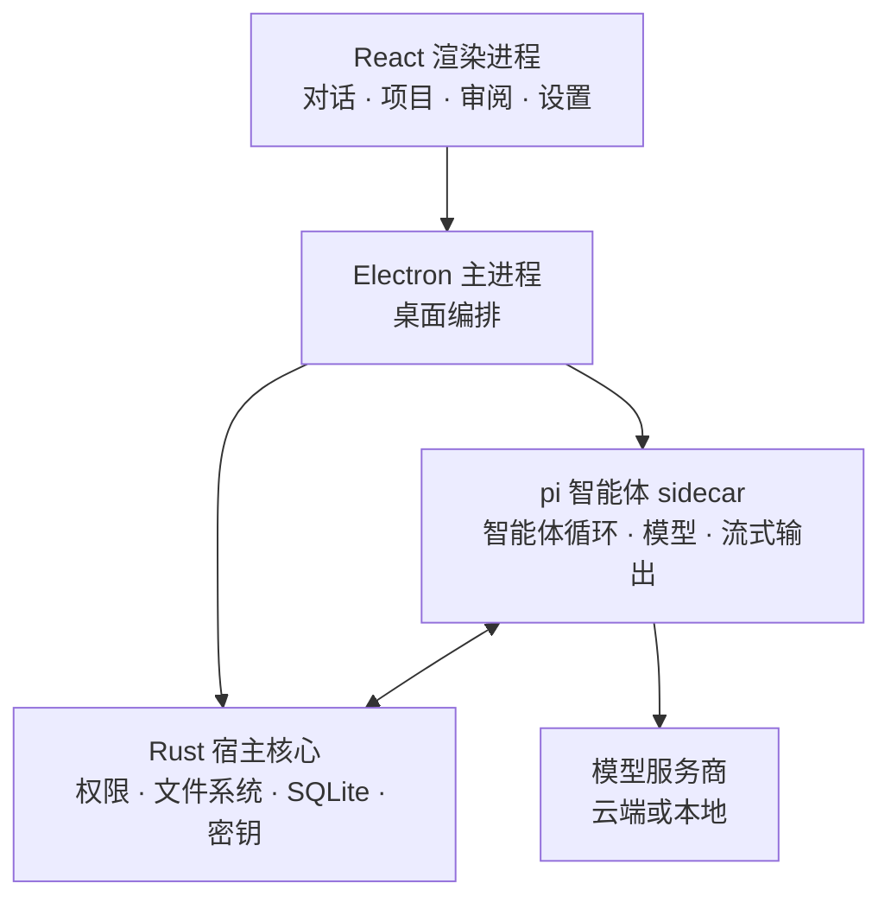

<div align="center">


# PI-Desktop

### 本地优先的 AI 编程智能体桌面工作区。

**自带模型。打开任意本地项目。让智能体干活——控制权始终在你手里。**

无需 PI-Desktop 账号。没有强制中转。也不绑定某一款编辑器。

<br />

[](https://github.com/vastsa/PI-Desktop/releases/latest)
[](https://github.com/vastsa/PI-Desktop/releases)
[](https://github.com/vastsa/PI-Desktop/stargazers)
[](https://github.com/vastsa/PI-Desktop/actions/workflows/ci.yml)
[](LICENSE)


**[下载 PI-Desktop](https://github.com/vastsa/PI-Desktop/releases/latest)** ·
[文档](https://pi-docs.aiuo.net/) ·
[界面截图](docs/zh-CN/guide/screenshots.md) ·
[English](README.md)

<br />


<sub>独立的桌面工作区，覆盖编程智能体、项目、模型、工具和长会话。</sub>

</div>

---

> [!IMPORTANT]
> **PI-Desktop 目前处于早期预览阶段。**
>
> 项目仍在积极开发，已经可以用于真实的编程工作流，但 API、扩展接口和部分桌面行为还会继续演进。

## 为什么是 PI-Desktop？

大多数编程智能体待在终端、编辑器插件或托管服务里。

PI-Desktop 给它们一个属于自己的工作区。

<table>
<tr>
<td width="50%" valign="top">

### 🖥️ 桌面优先

跨仓库、跨会话工作，不必把智能体流程绑在某一款编辑器或终端上。

项目、对话、审阅、文件、预览、通知和扩展都在同一个工作区里。

</td>
<td width="50%" valign="top">

### ✨ 自带模型

可用 OpenAI、Anthropic、本地模型、托管网关，或任何兼容 OpenAI 的 API。

配置多个服务商和模型，再按会话切换。

</td>
</tr>

<tr>
<td width="50%" valign="top">

### 🔍 默认可审查

智能体可以读文件、改代码、跑命令——但特权操作都要经过 PI-Desktop 的权限层。

核对 diff、查看命令输出，并决定每个会话能有多大自主权。

</td>
<td width="50%" valign="top">

### 🧩 为扩展而生

可添加 Skills、MCP 服务器、子智能体，以及可安装的插件。

插件可以贡献工具、命令、面板、主题、服务、技能，以及新的工作区体验。

</td>
</tr>
</table>

---

## 从一句话到一处补丁

上手只需几步：

1. **接入模型**
   打开 **设置 → 模型配置**，选择服务商或兼容 API，并填入凭证。

2. **打开项目**
   从侧边栏添加任意本地仓库或项目目录。

3. **选智能体、规划或目标**
   **智能体** 直接开干。**规划** 先出一份不能改的实施方案，你批了才执行。**目标** 你先批结果，路径由智能体自己选。

4. **审阅结果**
   在审阅面板里检查改动，查看命令输出，预览应用，然后继续对话——全程不必离开 PI-Desktop。

---

## 不只是聊天窗口

### 智能体、规划与目标

同一个智能体，三道闸。三种模式都还走权限层。

| | **智能体** | **规划** | **目标** |
| --- | --- | --- | --- |
| 你批准什么 | 不用额外批 | 实施方案 | 结果和验收标准 |
| 智能体做什么 | 读代码、改文件、跑命令、测、接着改 | 先研究仓库，写出一份冻结的方案，然后等你 | 自己选路，一直干到目标达成 |
| 什么时候用 | 小改动，想让它直接干 | 改动面大或有风险，想先看做法 | 你只关心结果，不关心路径 |

**智能体** 就是默认循环：看代码、改文件、跑命令、继续迭代。

**规划** 是审批边界。智能体先调研，产出一份不能改的实施方案。你点头之前不会动手改仓库。

**目标** 只锁结果。你先确认目标和验收标准，路径交给智能体。

---

### 把工作委派给子智能体

大任务很少适合塞进同一个上下文窗口。

PI-Desktop 可以把相对独立的工作交给后台子智能体，例如：

* 代码库探索
* 多文件实现
* 调研与排查
* 测试分析
* 对抗式审查

每个子智能体在自己的上下文中运行，并把结果回报给父智能体。

---

### 为长会话准备的工作区

PI-Desktop 的设计不只是一次提问。

你可以管理多个项目和会话，置顶或归档对话，给会话开分支，在智能体运行时排队下一条提示，用 `@` 引用文件，使用斜杠命令，并在应用内搜索。

流式回复会写入检查点，因此中断的工作在应用重启或运行时故障后，仍有机会继续。

---

## 模型由你选

PI-Desktop 不会把智能体运行时锁死在一份硬编码模型名单上。

可用：

* OpenAI 和 Anthropic
* 兼容 OpenAI 的 API
* 托管模型网关
* Ollama、LM Studio 这类本地网关
* 同一服务商下的多个模型
* 支持 OAuth 的厂商账号

模型配置可包含上下文窗口、输出上限、推理控制、温度，以及其他按模型定制的行为。

直接在输入区切换模型，不必重建会话。

---

## 审阅的是工作，而不只是答案

智能体工作区为编程过程中真正重要的内容提供了专门界面：

<table>
<tr>
<td width="50%">


<p align="center"><sub>带转录导航的长会话</sub></p>

</td>
<td width="50%">


<p align="center"><sub>按会话切换服务商、模型和推理级别</sub></p>

</td>
</tr>
<tr>
<td width="50%">


<p align="center"><sub>通过插件市场扩展工作区</sub></p>

</td>
<td width="50%">


<p align="center"><sub>添加服务商并接入模型</sub></p>

</td>
</tr>
</table>

<p align="center">
<a href="docs/zh-CN/guide/screenshots.md"><strong>查看全部界面 →</strong></a>
</p>

---

## 不用重建应用也能扩展

按你想把智能体定制到多深，PI-Desktop 提供了多层扩展能力。

### Skills

给智能体可复用的指令和工作流。

Skills 可以全局安装，也可以按项目启用。

### MCP

通过 Model Context Protocol 服务器接入外部工具和服务，不必把它们写进桌面应用。

### 子智能体

创建带有独立指令、工具和模型选择的专用智能体，再从另一个智能体把工作委派给它们。

### 插件

插件可以扩展 PI-Desktop 本身，例如：

* 智能体工具
* 命令
* 工作区面板
* 工作面板视图
* Skills
* MCP 服务器
* 子智能体
* 主题
* 常驻服务
* 插件间消息

插件可通过本地安装或市场安装，使用 `.piplug` 包工作流。

> [!NOTE]
> 插件进程受权限控制，并与渲染进程隔离，但插件仍是用户信任代码，而不是完整的操作系统沙箱。请只安装你信任的插件。

[从零开发第一个插件 →](docs/zh-CN/plugin-development.md)

---

## 本地优先，说清楚

PI-Desktop 是 **本地优先**，不是“永远不碰网络”。

| 数据 | 行为 |
| -------------------- | ------------------------------------------------------- |
| 对话 | 以 JSONL 本地存储，并配 SQLite 索引 |
| 设置 | 保存在你的电脑上 |
| API 凭证 | 存入操作系统钥匙串 |
| 日志 | 仅本地 |
| PI-Desktop 遥测 | 无 |
| 模型请求 | 直接发往你配置的服务商或接口 |

不需要 PI-Desktop 账号，你的电脑和模型服务商之间也没有强制的 PI 托管中转。

如果你使用远程模型服务商，该次请求所需的上下文会按该服务商自己的隐私政策发送过去。

---

## 下载

从 **[GitHub Releases](https://github.com/vastsa/PI-Desktop/releases/latest)** 下载最新构建。

| 平台 | 架构 | 安装包 |
| -------- | ------------- | -------------------- |
| macOS | Apple Silicon | `.dmg` / `.zip` |
| macOS | Intel | `.dmg` / `.zip` |
| Windows | x64 | NSIS 安装程序 |
| Linux | x64 | `.AppImage` / `.deb` / `.asar` |

打包版本会检查 GitHub Releases 上的更新，并在应用内提示新版本。Linux `.asar` 文件用于配合系统 Electron 重新打包；补齐目标发行版所需的原生 host 和资源后，可运行 `electron PI-Desktop-<version>-linux-x64.asar` 启动。

### Linux

Linux x64 安装包需要 **glibc 2.35** 或更高版本，对应：

* Ubuntu 22.04 及以上
* Debian 12 及以上
* Fedora 36 及以上

Ubuntu 20.04、Debian 11、Fedora 35 及更旧的发行版无法加载自带的 host。可用 `ldd --version` 查看本机 glibc。

### macOS

带标签发布工作流程会在发布前使用 Developer ID 凭据完成 macOS 工件的签名、公证和装订。

---

## 导入已有会话

已经在用其他编程智能体？

PI-Desktop 可以从受支持的工具导入本机会话，包括：

* Claude Code
* Codex
* OpenCode
* Pi

打开 **设置 → 导入**，把已有工作带进桌面工作区。

---

## 架构

PI-Desktop 有意把用户界面、特权宿主能力和智能体循环分开。



渲染进程没有 Node 集成。

**Rust 宿主核心** 负责特权工作区操作、权限、持久化和密钥。**pi 智能体 sidecar** 负责模型交互和智能体循环。Electron 协调桌面生命周期，同时保持这些职责分离。

[阅读架构规格 →](docs/zh-CN/spec/02-architecture/01-architecture.md)

---

## 项目状态

PI-Desktop 处于积极开发中的早期预览阶段。

当前 **0.14.x** 版本线包含：桌面外壳、流式智能体运行时、智能体 / 规划 / 目标工作流、带权限的工作区工具、项目与会话、会话导入、MCP / Skills / 子智能体、后台委派、多服务商模型配置、插件与市场、上下文检查点、通知、更新日志，以及跨平台打包。

当前优先事项包括：

* macOS 带标签发布的资格验证
* 安装升级与回滚资格验证
* 持续加固运行时和会话恢复
* 更强的插件沙箱与发布者校验
* 更广的 UI 驱动端到端覆盖

可通过[项目看板](docs/project/BOARD.md)和[里程碑](docs/zh-CN/spec/06-delivery/01-mvp-milestones.md)跟进开发进展。

---

## 参与开发

### 环境要求

* Node.js `>=22.19`
* pnpm `>=10`
* stable Rust 工具链

仓库当前锁定 pnpm 11，CI 与发布构建使用 Node 24。

### 本地运行

```bash
git clone https://github.com/vastsa/PI-Desktop.git
cd PI-Desktop

pnpm install

cargo build -p host-core
pnpm build:js

pnpm dev
```

### 校验改动

```bash
pnpm typecheck
pnpm lint
pnpm test
```

更多协议、规划、监管、子智能体和 Electron E2E 套件见仓库规格。

### 文档

```bash
pnpm docs:dev
pnpm docs:check
```

常用参考：

* [文档](https://pi-docs.aiuo.net/)
* [规格索引](docs/zh-CN/spec/README.md)
* [架构](docs/zh-CN/spec/02-architecture/01-architecture.md)
* [产品范围](docs/zh-CN/spec/01-product/01-product-scope.md)
* [插件开发](docs/zh-CN/plugin-development.md)
* [E2E 测试计划](docs/zh-CN/spec/06-delivery/04-e2e-test-plan.md)
* [发布操作手册](docs/zh-CN/spec/06-delivery/06-release-runbook.md)
* [仓库智能体指南](AGENTS.md)

---

## 贡献

欢迎提交 issue、缺陷报告、功能建议、文档改进和 pull request。

较大的改动建议先开 issue，便于与现有架构和产品约定对齐。

在仓库中工作时，请从 [AGENTS.md](AGENTS.md) 和[规格索引](docs/zh-CN/spec/README.md)开始。

[报告问题](https://github.com/vastsa/PI-Desktop/issues/new/choose) ·
[查看未关闭的 issue](https://github.com/vastsa/PI-Desktop/issues)

---

## 建立在开源之上

PI-Desktop 建立在优秀的开源生态之上。

智能体运行时使用 **pi-mono** 中的 [`pi-ai`](https://github.com/badlogic/pi-mono) 和 `pi-agent-core`。

桌面应用使用的技术包括 Electron、React、TypeScript、Rust、SQLite、Vite、Tailwind CSS、Shiki、Mermaid、KaTeX、TypeBox 和 i18next。

感谢每一个让 PI-Desktop 成为可能的项目和贡献者。

---

## 模型致谢

这个项目是由下面这些模型共同创造的——没有唯一的天才，只有一支由 token 驱动的施工队。

| 厂商 | 模型 | Token 总量 |
| --- | --- | ---: |
| OpenAI | `gpt-5.6-luna` | 5,304,019,817 |
| OpenAI | `gpt-5.6-sol` | 4,825,458,273 |
| OpenAI | `gpt-5.4` | 4,213,269,324 |
| Anthropic | `claude-opus-5` | 3,909,952,653 |
| OpenAI | `gpt-5.5` | 3,800,382,171 |
| xAI | `grok-4.5` | 1,947,736,115 |
| xAI | `grok-4.6` | 797,233,571 |
| DeepSeek | `deepseek-v4-flash` | 329,790,234 |
| OpenAI | `gpt-5.2-codex` | 320,983,170 |
| Xiaomi | `mimo-v2.5-pro` | 304,822,052 |
| Anthropic | `claude-fable-5-1` | 302,580,552 |
| OpenAI | `gpt-5.6-terra` | 274,107,085 |
| OpenAI | `gpt-5.3-codex` | 255,366,945 |
| OpenAI | `gpt-5.1-codex-max` | 220,947,212 |
| OpenAI | `gpt-5.1` | 142,533,699 |
| — | `Unknown model` | 69,801,632 |
| Anthropic | `claude-opus-4.6` | 55,223,768 |
| 智谱 | `stealth/ox-alpha` | 22,954,876 |
| Anthropic | `claude-fable-5` | 16,116,907 |
| OpenAI | `gpt-5.1-codex-mini` | 12,895,478 |
| 小红书 | `dots-3-note-prev` | 10,166,895 |
| OpenAI | `gpt-5.1-codex` | 3,916,509 |
| Xiaomi | `mimo-v2.5` | 3,785,071 |

**所列模型合计：** 27,144,044,009 tokens。

---

## 社区友链

- [Linux.Do](https://linux.do/) — 技术交流与分享社区。

## 许可证

PI-Desktop 采用 **GNU Lesser General Public License v3.0** 授权。

详见 [LICENSE](LICENSE)。

---

<div align="center">

### 用你想要的模型构建。把工作流留在自己手里。

**[下载 PI-Desktop](https://github.com/vastsa/PI-Desktop/releases/latest)**

<sub>macOS · Windows · Linux</sub>

</div>
